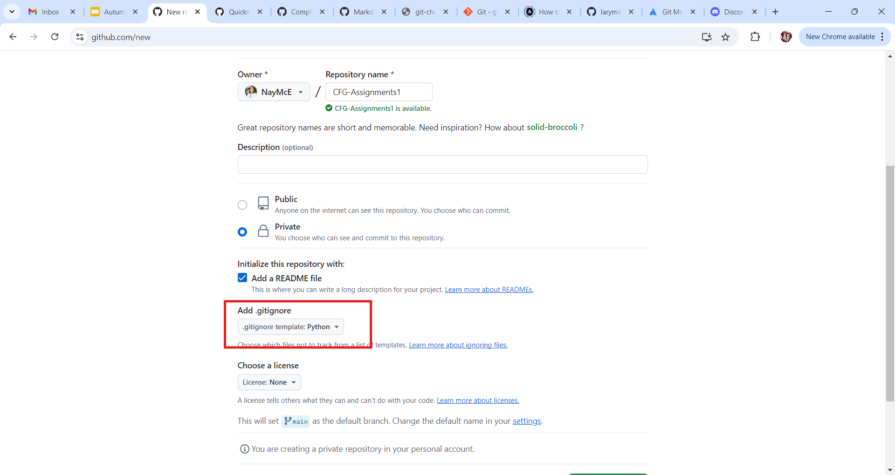

# CFG-Assignments

## Assignment One 

### About Me

Hi I'm Naomi :wave: I love to learn 
new skills. whether that's in video editing, motion graphics or coding skills. I'm always
looking for new ways to improve and learn.

I began my coding journey about 7 years ago when I started 
playing around with [Codecademy](https://www.codecademy.com/) for fun. 
This year however I started implementing code in my work 
projects to build an intranet site for my department. 
This then lead me to join [Code First Girls](https://codefirstgirls.com/) for my first **Kickstarter
course in Web Development** and now onto the **Software Engineering Degree** :smiley:

### My previous coding experience:

| Language   | Experience  | Length of Experience |
|------------|-------------|----------------------|
| HTML       | Intemediate | One Year             |
| CSS        | Intemediate | One Year             |
| JavaScript | Beginner    | 6 months             |
| Python     | Beginner    | 2 months             |

### Getting to know GitHub:

My Local and Remote Repository

- After creating my GitHub account I began by creating my repository ensuring to add
a readme and a gitignore file.

- I then opened my PyCharm to link my remote repository with my local. First clicking
on "Get from VCS":

- Then choosing GitHub from the left hand options and choosing the correct repo:

Pushing to GitHub

- Starting with checking the status I used the terminal to command git status:

- Next step was to command git add .

- Checking that the files are correct I then used git commit -m "" to commit these file 
changes using a clear and meaningful message: 

- Next I used git push to push those changes to my remote GitHub:

Creating Branches

- I created a branch called "test-1" in a folder called "feature" by right clicking on the 
main branch in PyCharm and selecting "New Branch from 'main'", then naming the file "feature/test-1".

Creating a Pull Request

- In GitHub I clicked on Pull Request and then New Pull Request, checking at this stage that the correct branches are selected to merge into main.

- Checking that the brances are ok to merge then clicking on Create Pull Request:

- I didn't need to check with anyone reviewing the work so was ok to go ahead and 
continue to pull request.

Requirements.txt file

- Using Tools, Sync Python Requests and creating a requirements.txt file which will list 
all packages or libraries needed to work on anything for this project. Mine is currently blank. 

Check out my [LinkedIn Page](https://www.linkedin.com/in/naomi-mcewan-90900396/)